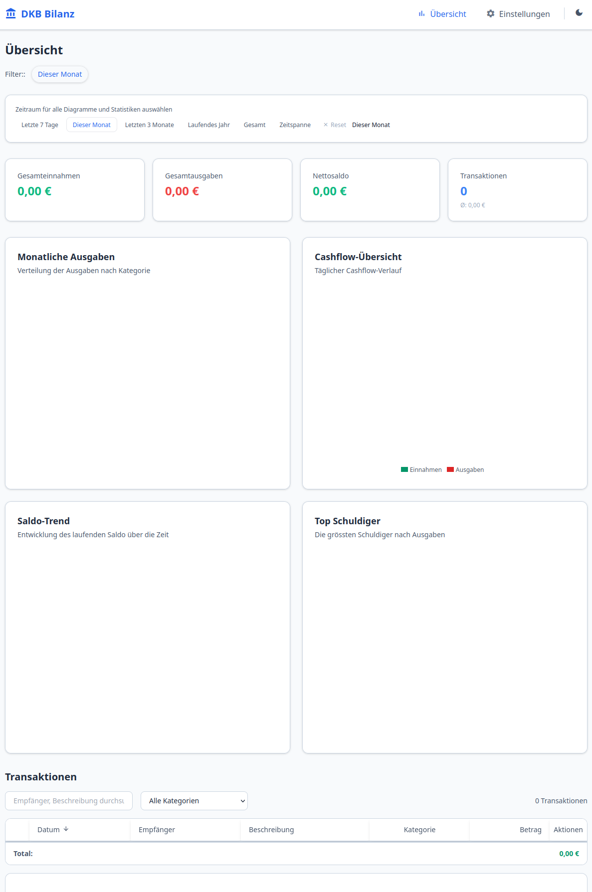

# DKB Transaction Manager

> **Disclaimer:** This is a fully AI-generated ("vibecoded slop") application. It comes with no guarantees, no support, and no promises. Use at your own risk. The code is messy, the architecture is questionable, and things might break at any moment. If it works for you, great. If not, tough luck.

Desktop application for importing, managing, and visualizing DKB bank account transactions. Import CSV bank statements, categorize transactions with keyword-based rules, and get spending insights through interactive charts.



## Features

- **CSV Import** - Import DKB bank statement CSV files with automatic duplicate detection via fingerprinting
- **Transaction Categorization** - Keyword-based auto-categorization with customizable category rules
- **Spending Analytics** - Monthly income/expense overview, category breakdown pie charts, top merchants ranking
- **Date Range Filtering** - Filter transactions by preset ranges (week, month, quarter, year, all-time) or custom dates
- **Manual Transactions** - Add custom transactions not present in bank statements
- **Dark/Light Theme** - Toggle between dark and light color schemes
- **Frameless Electron Window** - Custom title bar with native window controls
- **Multi-Platform** - Builds for Linux (AppImage, .deb), Windows (portable, NSIS installer), and macOS (DMG, zip)

## Tech Stack

| Layer | Technology |
|-------|-----------|
| Desktop Shell | Electron 31 |
| Backend | Express.js + TypeScript |
| Frontend | React 18 + Vite + Tailwind CSS |
| Charts | Recharts |
| Icons | Google Material Icons |
| Storage | Plain JSON files (no database) |
| Builder | electron-builder |
| Server Bundling | esbuild |

## Prerequisites

- Node.js >= 20
- npm >= 10

## Quick Start

```bash
# Install dependencies
npm install

# Start development servers (Express + Vite)
npm run dev

# Start Electron app in development mode
npm run electron:dev
```

The development setup runs three concurrent processes:
1. Express API server on `http://localhost:3001` (hot-reload via tsx)
2. Vite client dev server on `http://localhost:5173`
3. Electron shell that loads the Vite dev server

## Building

```bash
# Build everything (server TS, client Vite, bundle server)
npm run build

# Build for current platform
npm run dist

# Platform-specific builds
npm run dist:linux   # AppImage + .deb
npm run dist:win     # portable .exe + NSIS installer
npm run dist:mac     # DMG + zip (arm64 + x64)
```

### Cross-Platform Building

You **must build natively on each target OS**. Cross-compilation is not supported:

| Target | Build On | Output |
|--------|----------|--------|
| Linux | Linux | `DKB Transaction Manager-1.0.0.AppImage`, `.deb` |
| Windows | Windows | `.exe` (portable), NSIS installer |
| macOS | **macOS only** | `.dmg`, `.zip` (Apple requires native builds) |

Build artifacts land in `dist-electron/`.

### Running the AppImage

```bash
./dist-electron/DKB\ Transaction\ Manager-1.0.0.AppImage --no-sandbox
```

The `--no-sandbox` flag is required on some Linux distributions (e.g., when running as root or in containers).

## Data Storage

All data is stored as plain JSON files:

| Mode | Location |
|------|----------|
| Packaged app | `~/Documents/DKB Transaction Manager/` |
| Development | Project root `data/` |

Files:
- `transactions.json` - All imported and manually added transactions
- `categories.json` - Category rules with keywords and colors

On first launch, both files are initialized with empty arrays. A "Reset All Data" button in Settings permanently wipes both files (with double confirmation).

## Project Structure

```
dkb/
├── electron/              # Electron main process + preload
│   ├── main.js           # Window management, server spawning, IPC
│   └── preload.js        # Secure IPC bridge
├── server/
│   └── src/              # Express API (TypeScript)
│       ├── routes/       # Transaction + chart endpoints
│       ├── services/     # Storage, CSV parsing, categorization
│       └── utils/        # Fingerprinting, date ranges, formatting
├── client/
│   └── src/              # React frontend (TypeScript)
│       ├── pages/        # Dashboard, Settings
│       ├── components/   # Charts, modals, navigation, title bar
│       ├── hooks/        # Data fetching hooks
│       └── contexts/     # Theme context
├── scripts/              # Build scripts (server bundling)
├── data/                 # JSON data files (gitignored)
└── package.json          # Root config + electron-builder config
```

## Architecture

The app uses a three-process architecture:

1. **Electron main process** (`electron/main.js`) - Manages the browser window, spawns the Express server as a child process, serves the client build via a static HTTP server, and handles IPC communication
2. **Express server** (spawned child process) - Handles API requests, CSV parsing, data storage, and chart aggregation
3. **React renderer** (sandboxed, no Node integration) - Communicates with the backend via HTTP and with the main process via IPC for file operations and window management

In production, the Express server is bundled with esbuild into a single self-contained file. The client is served from a local HTTP server (port 5174) because Vite's absolute asset paths don't work with `file://` protocol.

## License

Licensed under the [Apache License, Version 2.0](LICENSE).
